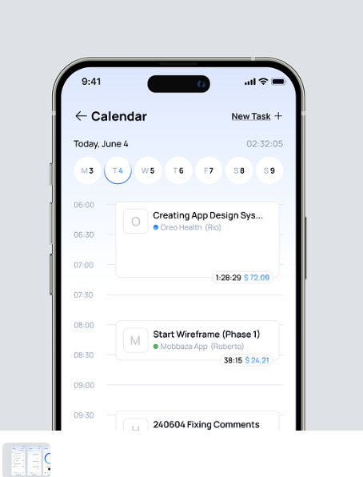
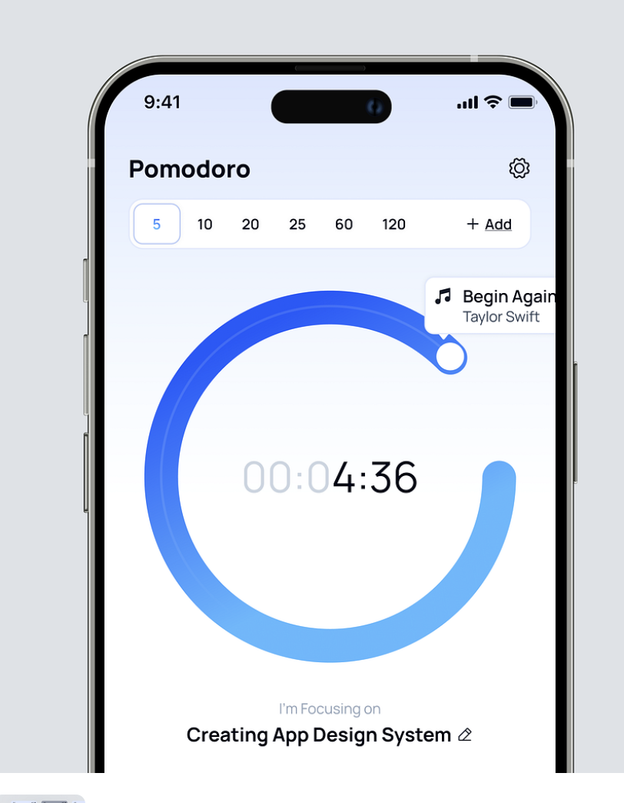

# 종합 앱

## 홈 (index.html)


```md
### 영화 표시 (난이도 중)

- fetch 사용
- tmdb API 활용

### 현재 날씨 표시 (난이도 중)

- fetch 사용
- OpenWeather API 활용

### 오늘 날짜와 대조하여 오늘 할 일 표시 (할일 누르면 Tasks로 이동) (난이도 중상)

- 로컬스토리지에 담긴 Tasks를 확인하여, 오늘 날짜에 해당되는 태스크들을 가져온다. (See more 표시 버튼 누르면 Tasks로 이동)
- 할일 클릭 시 해당 할일 수정 페이지로 이동
```

## 작업 목록 표시 (pages/tasks)



```md
1. 한 주 달력 표시 (오늘 날짜에 활성화 표시)
2. 해당 날짜 클릭시 해당 날짜에 해당하는 태스크 목록 출력 (타임까지는 안보여줘도된다.)
3. 작업 삭제 클릭시 작업 삭제
4. 작업 수정 클릭시 수정 페이지 이동
```

## 할일 추가 및 수정 (pages/add-task, pages/edit-task)

```md
1. 할일 제목을 입력 받는다.
2. 할일 설명을 입력 받는다.

### 수행 날짜를 입력 받는다.

- 텍스트로 날짜 입력 받는다. (예) 2024-08-20 (난이도 하)
- Date Picker 활용하여, 작업 추가 원하는 날짜 선택 가능 (상 - advanced)

### 태그를 입력 받는다.

- 태그를 입력받는다. (상 - advanced) - keydown Enter 이벤트 활용하여, 태그 추가 및 관련 태그들 표시
```

## 타이머 (pages/timer)



```md
### 타이머 구현

- requestAnimationFrame (cancelAnimationFrame)

- 버튼을 제공해서 (5분, 10분, 15분 등의 버튼을 누르면 해당 시간만큼 타이머 동작)
- 0초 미만으로는 떨어지지 않고, 0초가 되면 특정 동작 실행
  - 특정 동작 (완료 팝업 또는 초기화)
- start, reset, pause 이벤트 구현

- 시간이 남는 경우
  - 스탑워치도 구현 (start, pause, stop 등의 이벤트 처리)
  - 뽀모도로 기능도 구현
```
